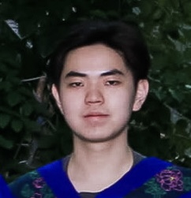

# About Xuechen(Daniel) Kan 
please read the file[README.md](README.md) in repository first

[interests and introduction](https://github.com/Daniel-Xkan/cse110Lab1/blob/vscode-ui)

[my cs skills](https://github.com/Daniel-Xkan/cse110Lab1/blob/vscode-ui)

[future goals](https://github.com/Daniel-Xkan/cse110Lab1/blob/vscode-ui)

**this is the webpage for cse110 lab1: gh pages**

## interests and introduction
Hi my name is Daniel Kan. Im currenly UCSD 3rd year undergrad student, insterests are Tennis, surfing, snowboarding, coding, and MONEY. Here is a link to [my personal portfolio](https://about-daniel.vercel.app/).

I also play games such as ~~valorant~~, *counterstrike*, *civilization IV*.

My fav quote is from an ancient Chinese philosopher Zhuang Zi:
>盈科而后进

which means *if you need to cross obstacles to pace forward in life*. 
This applies to my coding, namely hardworkingness in programming and always learning. 

## my cs skills
My fav language: python. Since you only need `print(hello world)` instead of `sys.out.println(hello world)`

My knowledge in programming: 
- python 
- c 
- C++ 
- Java 
- html 
- CSS 
- Javascript 
- React 
- Nodejs

Things i need to learn: 
1. json 
2. databases 
3. backend

## future goals
The way on finding programming jobs:
- [x] do some projects
- [] get an intern
- [] many teamwork
- [] good resume

<!-- include content that introduces who you are as a programmer and as a person.

 picture
    Headings
    Styling text
    Quoting text
    Quoting code
    External Links
Section links
 Relative links (Link to another .md file or an image in your repo. If linking to an image, encode it as a regular link rather than an image.)
    Ordered and Unordered Lists
T   ask lists -->